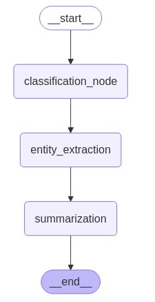

# 1. Introduction to langgraph:

LangGraph is a framework for creating applications using graph-based workflows. Each node represents a function or computational step, and edges define the flow between these nodes based on certain conditions.


Visuall work flow langgraph_framework.py


# Connect MCP

Step1: Install uv Package Manager
```bash

curl -LsSf https://astral.sh/uv/install.sh | sh
```
Step 2: Set up the Project
```bash
# Create and navigate to a project directory
mkdir mcp-crypto-server
cd mcp-crypto-server
uv init

# Create and activate virtual environment
uv venv
source .venv/bin/activate  # On Windows: .venv\Scripts\activate

# Install dependencies
uv add "mcp[cli]" httpx
```
Please checkout mcp_server.py to see how to build tools.


Start the server by runnning following commands in the ternimal:
```bash

uv run scripts.mcp_server.py
```

Integration with Claude Desktop

If you haven't download Claude Desktop, checkout this page:https://claude.com/download

