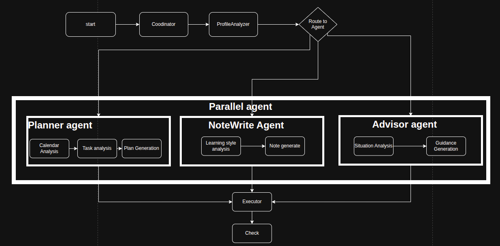
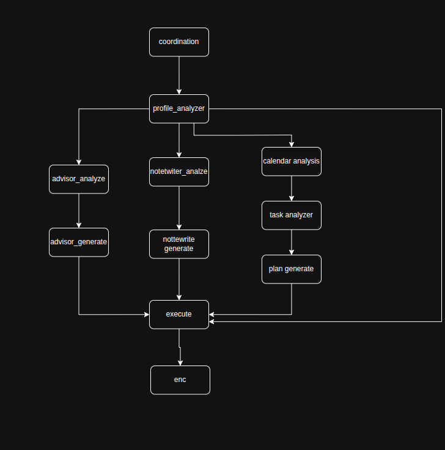

# ATLAS (Academic Task And Learning Agent System)

Implement how to built an interlligent multi-agent system that transforms the way student manage their academic life.
Create a newrork of specialized AI agent that work together to provide academic support, from autimatic scheduling to intellifgent lectures summarization.


## Motivation

Students face unpresendented challengent managing their academic workload alongside digital distraction and personal commitments. 
Tradditional study planning tools often fall short because:

+ Lack intelligent adaptation to invidual learning styles.
+ Don't intergrate with student's existing digital ecosystems
+ Fail to provide connect-aware assistance
+ Miss oppotunities for proactive intervention

ATLAS address these challegeny by through our sophisticated multi-agent architeture that combine advance language model with structure workflow to deliver personalized academic support.

## Key components:
+ Coordinator Agent: Orchestrated the interaction between specialized agent   and manages the overall system stage.
+ Planner Agent: Handel calendar interaction with schedual optimization
+ Notewriter Agent: proccess acdemic content and generate study materials
+ Advisor Agent: Provide personalized learning and time management advice.


## Implementation Method

ATLAS begins with a comprehensive initial assessment to understand each student's unique profile. The system conducts a thorough evaluation of learning preferences, cognitive styles, and current academic commitments while identifying specific challenges that require support. This information forms the foundation of a detailed student profile that drives personalized assistance throughout their academic journey.

At its core, ATLAS operates through a sophisticated multi-agent system architecture. The implementation leverages LangGraph's workflow framework to coordinate four specialized AI agents working in concert. The Coordinator Agent serves as the central orchestrator, managing workflow and ensuring seamless communication between components. The Planner Agent focuses on schedule optimization and time management, while the Notewriter Agent processes academic content and generates tailored study materials. The Advisor Agent rounds out the team by providing personalized guidance and support strategies.

The workflow orchestration implements a state management system that tracks student progress and coordinates agent activities. Using LangGraph's framework, the system maintains consistent communication channels between agents and defines clear transition rules for different academic scenarios. This structured approach ensures that each agent's specialized capabilities are deployed effectively to support student needs.

Learning process optimization forms a key part of the implementation. The system generates personalized study schedules that adapt to student preferences and energy patterns while creating customized learning materials that match individual learning styles. Real-time monitoring enables continuous adjustment of strategies based on student performance and engagement. The implementation incorporates proven learning techniques such as spaced repetition and active recall, automatically adjusting their application based on observed effectiveness.

Resource management and integration extend the system's capabilities through connections with external academic tools and platforms. ATLAS synchronizes with academic calendars, integrates with digital learning environments, and coordinates access to additional educational resources. This comprehensive integration ensures students have seamless access to all necessary tools and materials within their personalized academic support system.

The implementation maintains flexibility through continuous adaptation and improvement mechanisms. By monitoring performance metrics and gathering regular feedback, the system refines its recommendations and adjusts support strategies. This creates a dynamic learning environment that evolves with each student's changing needs and academic growth.
Emergency and support protocols are woven throughout the implementation to provide immediate assistance when needed. The system includes mechanisms for detecting academic stress, managing approaching deadlines, and providing intervention strategies during challenging periods. These protocols ensure students receive timely support while maintaining progress toward their academic goals.

Through this comprehensive implementation approach, ATLAS creates an intelligent, adaptive academic support system that grows increasingly effective at meeting each student's unique needs over time. The system's architecture enables seamless coordination between different support functions while maintaining focus on individual student success.


### Overall structure





# Test Demo

Run the demo locally using **Conda**.

### 🤖 LLM

* **Model:** `nvidia/nemotron-3.5-lightning-30b-a3b`
* **API:** [NVIDIA Build](https://build.nvidia.com/models)

### OR
* **Model:** `openai-4o-mini`

### ⚙️ Configuration

Create a `.env` file in the project directory:

```env
BASE_URL=https://integrate.api.nvidia.com/v1
MODEL_NAME= MODEL USING
MEMOTRON_3_5_LIGHTNING_30B_A3B_KEY=YOUR_API_KEY

OPENAI_API_KEY=YOUR_API_KEY
```

### 🚀 Run

```bash
cd MultiAgent_edu/ATLAS
python -m run
```

> **Note:** Replace `YOUR_API_KEY` with your NVIDIA API key.
